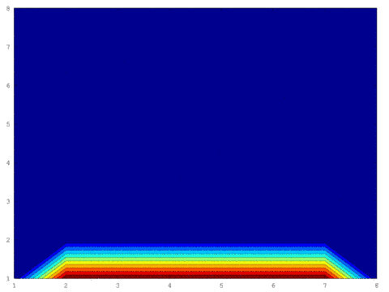

# 2D Trainsient Heat Conduction in 1kB


## Overview
This is a real-time solver for 2D transient heat conduction with isothermal boundary conditions in less than 1kB of program space. It is intended to be visualized on an LED board with an equivalent number of LEDs in the x and y directory. It was developed by Vector Space as an entry for the 2017, [1kB Hackaday Challenge](https://hackaday.io/contest/18215-the-1kb-challenge).

## Code Size
The following output generated by running `make` in the `avr/src` directory shows that when compiled with avr-gcc version 4.9.2 the binary size of the program falls less than or equal to 1kB. 1024 bytes exactly!

```
avr-gcc --version
avr-gcc (GCC) 4.9.2
Copyright (C) 2014 Free Software Foundation, Inc.
This is free software; see the source for copying conditions.  There is NO
warranty; not even for MERCHANTABILITY or FITNESS FOR A PARTICULAR PURPOSE.

avr-gcc -mmcu=atmega328p -std=gnu99 -Os -ffunction-sections -fdata-sections -Wl,--gc-sections -Wl,-Map=conduction.map -flto -mrelax -lm -nostartfiles -g3 -DNO_VECTORS -DF_CPU=16000000 -I startup/common main.c spi.c adc.c rgb_matrix.c colormap.c conduction.c timer.c interpolate.c startup/crt1/gcrt1.S -o conduction
avr-size conduction
   text    data     bss     dec     hex filename
      1024        0    1600    2624     a40 conduction
      avr-objcopy -O ihex -R .eeprom conduction conduction.hex
```
